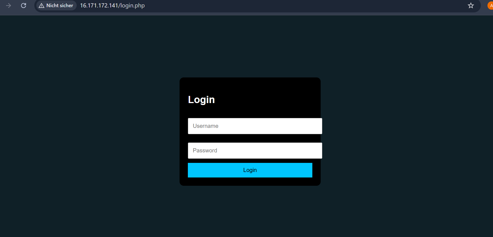
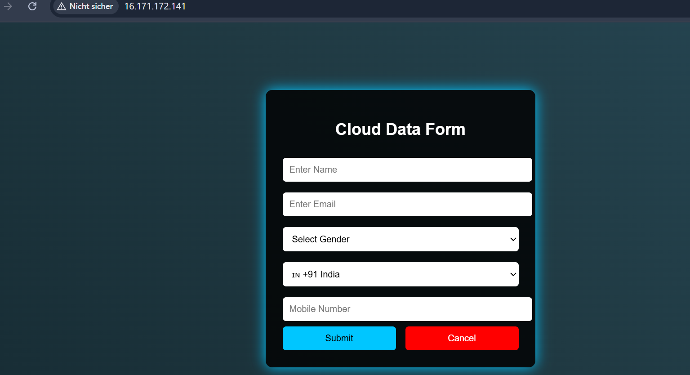
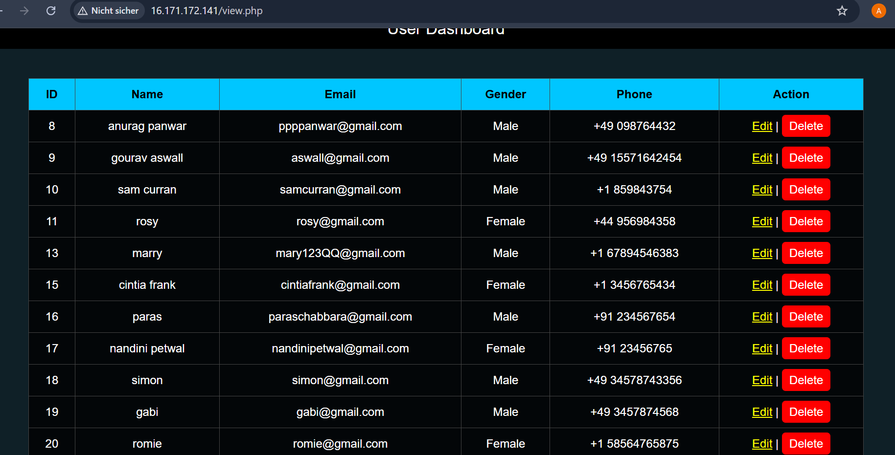
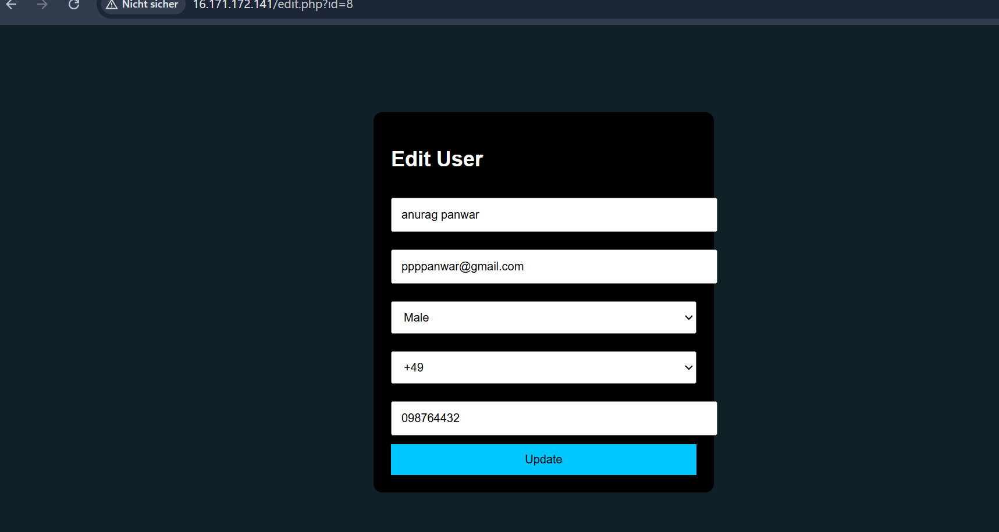
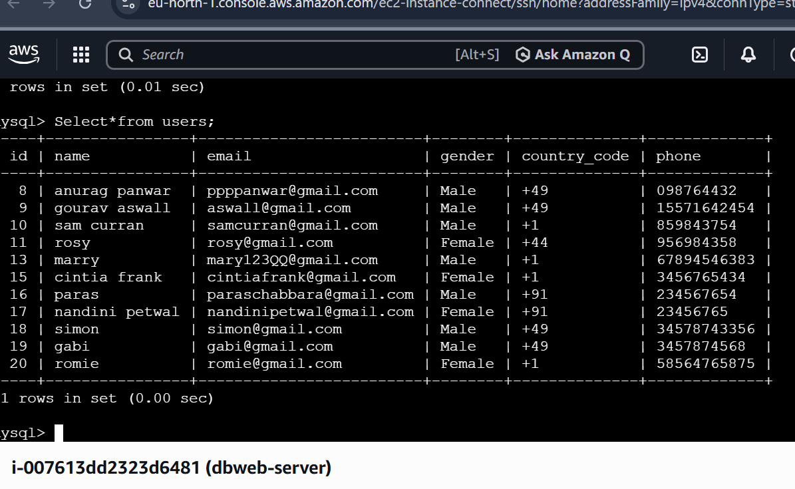
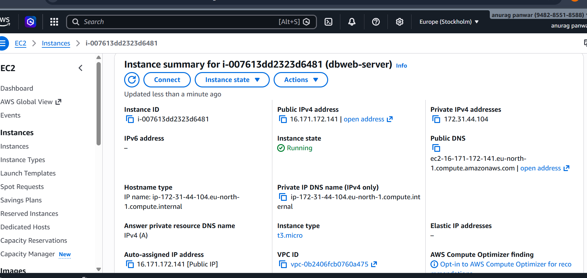
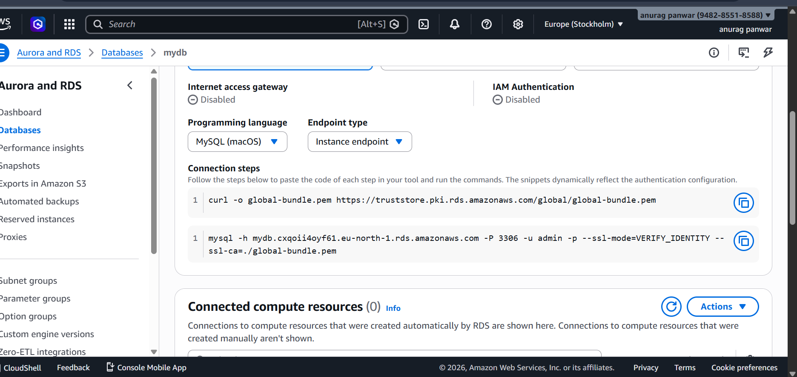

#  Dynamic Web Application on AWS (EC2 + RDS)

##  Project Overview
This project demonstrates the design and deployment of a full-stack cloud-based web application using AWS services. The application enables users to securely submit, view, update, and delete data through a web interface with authentication.

---

##  Architecture

User → Authentication → EC2 (Apache + PHP) → RDS (MySQL Database)

---

##  AWS Services Used

- Amazon EC2 (Elastic Compute Cloud)
- Amazon RDS (Relational Database Service - MySQL)
- Amazon VPC (Networking & Security)
- Security Groups (Firewall rules)

---

##  Technologies & Tools

###  Backend
- PHP (Server-side scripting)
- MySQL (Database)

###  Frontend
- HTML
- CSS (Dark UI + Responsive Design)

###  Server & OS
- Apache Web Server
- Linux (Ubuntu)

###  Authentication
- Session-based login system
- Secure route protection

---

##  Features

###  Authentication System
- Login page with session management
- Protected dashboard access
- Logout functionality

###  Form System
- User input form with modern dark UI
- Fields: Name, Email, Gender, Country Code, Phone

###  Dashboard
- View all user records in table format
- Clean UI with structured layout

###  CRUD Operations
- Create → Insert data into database
- Read → Fetch and display data
- Update → Edit existing records
- Delete → Remove records from database

###  Cloud Integration
- Hosted on AWS EC2
- Connected to AWS RDS (MySQL)
- Secure communication using Security Groups

---

##  Screenshots

###  Login Page

###  Form UI

###  Dashboard

###  Edit Page

###  Database (MySQL)

###  AWS EC2

###  AWS RDS

---

##  Security Implementation

- Used AWS Security Groups to restrict access
- Allowed database access only from EC2 instance
- Implemented session-based authentication
- Controlled HTTP and SSH access securely

---

##  Key Learning Outcomes

- Designed and deployed a cloud-based web application
- Integrated EC2 with RDS for dynamic data handling
- Implemented full CRUD functionality
- Built authentication system using PHP sessions
- Managed Linux server and Apache configuration
- Gained hands-on experience with AWS networking and security

---

##  Live Demo

http://16.171.172.141/

---

## 📂 Project Structure
